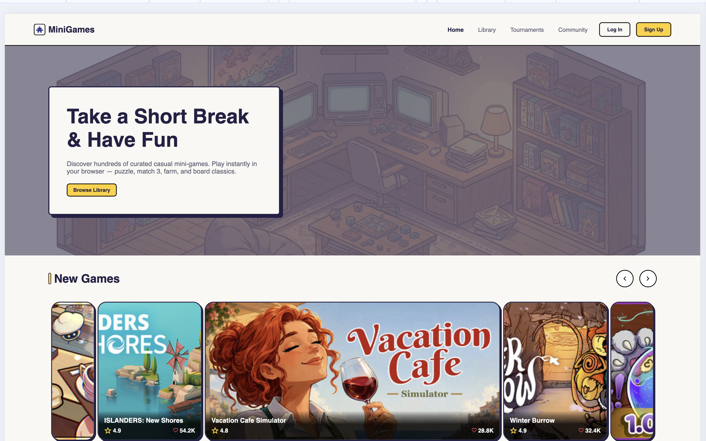
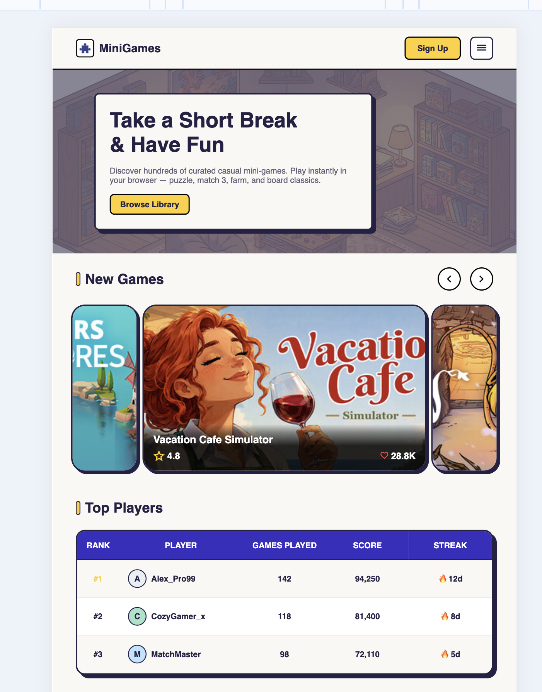
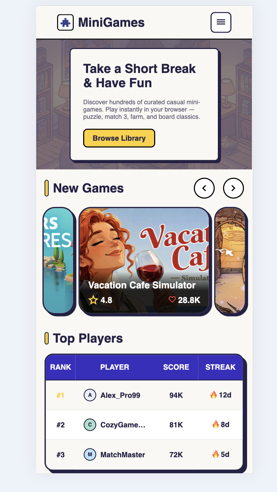

# MiniGames — Story 1

1. **Task:** [MiniGames Story 1](https://github.com/rolling-scopes-school/qualifying-stage/blob/main/tasks/minigames/story-1.md)

2. **Screenshot:**

### Desktop

### Tablet

### Mobile

3. **Deployment:** https://marassanovad.github.io/minigames/

4. **Done:** 20.09.2026 / **deadline:** 21.09.2026

5. **Score:** 294 / 294

---

## Self-check

### Repository Setup — 25/25

- [x] GitHub repository contains README, `.gitignore` and project dependencies — **10**
- [x] Project has a clear and scalable folder structure — **10**
- [x] Pull Request template is configured — **5**

### Development Environment — 63/63

- [x] Bundler with development and production builds — **10**
- [x] TypeScript is configured and used in the project — **5**
- [x] ESLint is configured — **5**
- [x] Prettier is configured — **5**
- [x] Husky is configured with a pre-commit hook — **8**
- [x] Sass, design tokens, breakpoints and shared styles are implemented — **10**
- [x] Application works as a Single Page Application — **20**

### Development Scripts — 10/10

- [x] ESLint script is available — **5**
- [x] Prettier script is available — **5**

### Adaptive Home Page — 130/130

- [x] Header with unauthenticated state — **15**
- [x] Responsive mobile header with burger menu — **25**
- [x] Hero section — **15**
- [x] New Games carousel/slider — **25**
- [x] Top Players / leaderboard section — **15**
- [x] Developer section — **15**
- [x] Footer — **20**

### Auth Dialog — 50/50

- [x] Login/Register dialog trigger, positioning and backdrop — **10**
- [x] Open/close animations and transitions — **10**
- [x] Login/Register switcher and form rendering — **10**
- [x] Semantic forms and correct input types — **10**
- [x] Responsive dialog and visual states — **10**

### Global Layout — 16/16

- [x] Semantic HTML and correct page layout — **12**
- [x] Favicon is configured — **4**

---

## Additional Checks

- [x] Feature branches are used for development
- [x] Changes are integrated into the `story-1` branch
- [x] Final Cross-Check PR is created from `story-1` to the base branch
- [x] Console logs are removed
- [x] CSS magic values are reviewed and replaced with design tokens where appropriate
- [x] PR description follows RS School requirements

## Current Result

The MiniGames Story 1 functionality and layout are fully implemented according to the task requirements.

- TypeScript, ESLint, Prettier, Husky and Sass are configured.
- SPA routing is implemented.
- The Home page contains all required sections.
- Responsive layouts are implemented for desktop, tablet and mobile.
- Authentication forms use semantic HTML and appropriate input types.
- Authentication dialog animations and responsive states are implemented.
- Code cleanup and final rubric verification have been completed.
- The application is deployed to GitHub Pages.

**Self-check score: 294 / 294**
